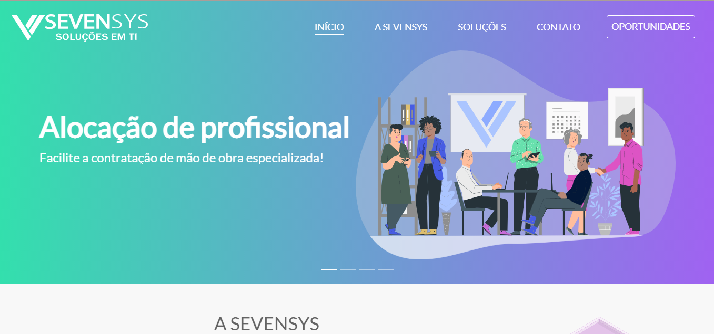

# **Novo site SevenSys - Soluções em TI - 2021/1**

O novo site foi feito para repaginar o antigo e modernizar e, como forma de aprendizado pessoal.

Foi estruturado em HTML5, estilizado com CSS3 e alguns efeitos com uso do JavaScript.

A primeira página - index.hmtl, conta com um carrossel onde tem os links dos assuntos principais abordados. 
Após, tem uma breve descrição sobre a empresa e um link que leva para a página quem somos, seguindo, vemos os números da SevenSys. 
Em seguida, é falado sobre as soluções que a SevenSys oferece e segmentos atendidos. 
Ao final da página, tem um descritivo sobre o que é ser um Tech Ninja na empresa com um link que leva para a página de oportunidades.

A página sobre a SenvenSys - quem-somos.html, contém uma descrição sobre a trajetória da empresa e linha do tempo.
Descrição sobre a vida profissional do fundador da empresa. Tem ainda um texto sobre a Missão, Visão, Valores e Política da empresa.
E por último um pouco sobre as especialidades que a empresa oferece.

Na página sobre as Soluções - solucoes.html, há uma introdução sobre soluções, logo abaixo o link para as páginas específicas de 
cada solução da empresa. Em seguida há um texto introdutório sobre Inovação tecnológica e dois tópicos sobre Tecnologia 4.0 e 
Transformação Digital. Ao final da página, há um link que leva para a página de contato.
    
A página sobre Alocações de profissionais de TI - alocacoes.html, tem uma descrição sobre alocação de profissionais, 
e abaixo há 4 tópicos descrevendo como é ter um alocado. Logo após, tem as vantagens descritas. Link que vai para a 
página de contato.

A página sobre Fábrica de software e App - fabrica.html, tem uma descrição sobre fábrica de software e app, 
e abaixo há 4 tópicos descrevendo como é contratar a fábrica. Logo após, tem as vantagens descritas. Link que vai para a 
página de contato.

A página sobre Gerenciamento de projetos - projeto.html, tem uma descrição sobre gerenciamento de projetos, 
e abaixo há 4 tópicos descrevendo como é o serviço de gerenciamento. Logo após, tem as vantagens descritas. Link que vai para a 
página de contato.

Na página de Contato - contato.php, há um formulário para envio de e-mail direto na página. Ao lado há o endereço da empresa e
todos os contatos de telefone/whatsapp e o e-mail de contato da empresa. Após, um link para a página de oportunidades.

A página de Oportunidades - oportunidades.php, há um texto para engajar os futuros Tech Ninjas, logo após está as vagas ofertadas 
e o banco de talentos, caso alguém não se identifique com alguma vaga.

Em todas as páginas temos o menu e o rodapé. 
    
## **Detalhes das páginas**

### Animação pré-carregamento

- Gif animado de um Tech Ninja
    - utilizado JS para animação e CSS

### Menu e Rodapé:
 
_Menu:_
         
- Contém a logo da empresa, que possui um link para a página inicial, e os links das páginas que são: 
            
    - Início 
    - A SevenSys
    - Soluções
        - Alocação de profissionais de TI 
        - Fábrica de software e App 
        - Gerenciamento de projetos
    - Contato 
    - Oportunidades

    - Menu é fixo no topo da página.
    - O background possui o efeito glassmorphism.
    - Quando passado o mouse em cima do link, uma borda inferior acompanha o tamanho da palavra.
    - Quando em uma página específica, o link no menu fica marcado para saber em qual página a pessoa está.
    - O link da página de oportunidades possui um background colorido e efeito de opacidade quando passado o mouse em cima
    - A logo e os links mudam da cor branca para roxo e vice e versa conforme muda a cor de fundo da página. Esse efeito 
      é aplicado através do JS.
        
_Rodapé:_ 
        
- Contém o mapa com endereço da empresa.
- Abaixo tem a logo, links das páginas, endereço e contatos da empresa e, os links das redes sociais.
    - O background possui um degradê.
    - Os links das páginas, endereço e contatos possuem um efeito que muda de cor ao passar o mouse em cima.
    - Os links das redes sociais possuem um efeito de tooltip e preenchimento de cor ao passar o mouse em cima.
     
### Index

- Um carrossel de imagens e links para as páginas espefíficas sobre os assuntos.
- Breve texto sobre a empresa, um link para a página sobre a SevenSyn e uma ilustração.
    - Esse link possui um efeito hover que da espaçamento de 1px entre as letras
- Uma representação dos números da SevenSys com base nos seguidores do linkedin da empresa, de cucas comidas, 
  idéias geradas em projetos, de apitos soprados com fechamento de novos negócios e representação de usar mais projetos 
  digitais e menos papel.
    - o contador desses números e o efeito das letras é feito em JS.
- Uma breve descrição sobre as soluções que a empresa oferece dividida em 3 cards com informações frente e verso e em seguida mais 3 cards
  falando um pouco sobre inovação. 
    - Card Desktop: 
        - Ao passar o mouse em cima da imagem no card, ele vira e tem uma descrição do assunto e logo abaixo um botão com link para a página 
          sobre o assunto abordado. Esse link possui um efeito que imita luz/iluminação quando passado o mouse em cima.
    - Card Mobile: 
        - O card não possui efeito, ele tem a imagem e logo abaixo o texto. O Link ao passar o mouse em cima, ele aumenta 
          o espaçamento entre as letras em 1px.  
- Descrição sobre os segmentos que a empresa atende junto com uma ilustração.
- Uma descrição sobre o que é ser um Tech Ninja junto com uma ilustrção e tem um botão link que leva a página de oportunidades.
    - O link possui um efeito hover que da espaçamento de 1px entre as letras
    - A imagem possui um efeito de entrada, para isso foi instalado junto ao projeto a biblioteca animate.style.

### A SevenSys

- Banner com um texto e uma ilustração sobre o assunto.
    - A imagem possui um efeito de entrada, para isso foi instalado junto ao projeto a biblioteca animate.style.
- Descrição sobre a trajetória da empresa.
- Imagem com linha do tempo sobre as conquistas da empresa ao longo dos anos.
    - Desktop:
        - A imagem é na horizontal, com tamanho 1901x841 e um efeito de opacidade quando passado o mouse sobre a imagem.
    - Mobile:
        - A imagem é na vertical, com tamanho 500x943, sem efeitos
- Descrição sobre a vida profissional do fundador da empresa.
- Descrição sobre Missão, Visão, Valores e Política da empresa.
    - Cada assunto está em um box um ao lado do outro no caso de desktop e na vertical para mobile
    - Desktop: 
        - Cada box possui um tom em degradê na horizontal, que ao final um complementa o outro.
    - Mobile:
        - Cada box possui um tom em degradê na vertical, que ao final um complementa o outro.
- Descrição das especializações da empresa
    - Cada especialização está em um box de tom azul com uma borda mais clara e tem um ícone de certo na frente de cada texto.

### Soluções

- Banner com um texto e uma imagem sobre o assunto.
    - A imagem possui um efeito de entrada, para isso foi instalado junto ao projeto a biblioteca animate.style.
- Descrição sobre soluções.
- Links direcionando para as suas respectivas páginas e assuntos
    - Estão em um box, composto por um ícone e título da página e o link possui um efeito hover que da espaçamento de 1px entre 
      as letras.
- Assunto sobre Inovação, um descritivo.
- Há um destaque com fundo degradê na vertical, com os títulos de tecnologia 4.0 e transformação digital, e uma imagem 
  correspondente para cada um
    - As imagens possuem um efeito de entrada, para isso foi instalado junto ao projeto a biblioteca animate.style.
- Ao final da página, há um link que leva para a página de contato.
    - O link possui um efeito que clareia o tom da cor quando passado o mouse em cima.
    
### Alocação de profissinais de TI, Fábrica de software e App, Gerenciamento de projetos

Essas páginas possuem a mesma estrutura mudando somente o assunto e imagens.

- Banner com um texto e uma ilustração sobre o assunto.
    - A imagem possui um efeito de entrada, para isso foi instalado junto ao projeto a biblioteca animate.style.
- Descrição sobre o tema da página.
- Há um destaque com fundo dividido em quatro partes com cores intercaladas, cada um possui um descritivo sobre o assunto da 
  página e centralizado ao meio, há uma imagem ilustrando o assunto.
- Boxes ilustrando as vantagens referente ao assunto da página. 
    - Cada box tem um texto e um ícone referente a vantagem citada.
- Ao final da página, há um link que leva para a página de contato.
    - O link possui um efeito que clareia o tom da cor quando passado o mouse em cima.

### Contato

- Possui um formulário para preenchimento das informações e a mensagem que será enviado para o e-mail da empresa.
    - O botão de envio fica desativado até a pessoa preencher corretamente as informações, para isso há uma validação no backend.
    - O botão quando ativado possui um efeito ao redor.
- Na lateral, há o endereço da empresa e abaixo todos os contatos, telefone/whatsapp.
    - Para o whatsapp há um link, quando clicado abre o whatsapp com o contato da empresa para mandar mensagem.
- Há um box com uma frase e um link que leva para a página de oportunidades. 
    - O link possui um efeito que troca o tom da cor quando passado o mouse em cima e aumenta o espaçamento entre as letras em 1px.

### Oportunidades

- Possui uma frase e uma imagem de destaque.
    - A imagem possui um efeito de entrada, para isso foi instalado junto ao projeto a biblioteca animate.style.
- Há um texto com motivação para o candidato, e ao lado uma imagem.
    - A imagem possui um efeito de entrada, para isso foi instalado junto ao projeto a biblioteca animate.style.
- Há 5 cards que em cada um possui uma imagem e uma descrição em cada passo para fazer o cadastro em uma vaga ofertada 
  até ser contratado.
    - O background do card possui o efeito glassmorphism
- Os cards com as oportunidades em aberto, possuem o título da vaga e ao clicar abre um modal com a descrição 
  completa da vaga e um formulário para cadastro na vaga.
    - O card possui o efeito "vanilla-tilt", que ao passar o mouse em cima, o card se movimenta e também causa um 
      efeito de brilho. 
- O modal quando aberto possuim um título, a descrição da vaga e um formulário, onde o candidato preenche as suas informações.
    - O background do modal possui o efeito transparente. 
    - Os botões de fechar e de enviar o formulário possuem um efeito de diminuir a opacidade do botão quando passado o mouse em cima
- O card de banco de talentos possui o mesmo efeito que o card de vagas, somente muda o título.
- Há um menu fixo na lateral inferior esquerda, com uma imagem que possui links para os assuntos que ficam mais abaixo da página.

### Ícone para voltar ao topo da página

- Todas as páginas possuem o ícone para voltar ao topo da página, exceto de contato, pois a página não é extensa.
    - Este botão aparece somente quando está chegando ao final da página. Foi usado JS para mostrar ou ocultar o botão na página. 

## 🚧 Em fase final de construção 🚧

### Tecnologias utilizadas

- Linguagens: 

    - HTML5
    - CSS3
    - JavaScript
    
- Bibliotecas: 
    
    - Bootstrap
    - animação: animate.style
    - Jquery;
    
## Autor

- Frontend 
    - Joice Ramos
    

- Backend
    - Felipe Pereira
    

